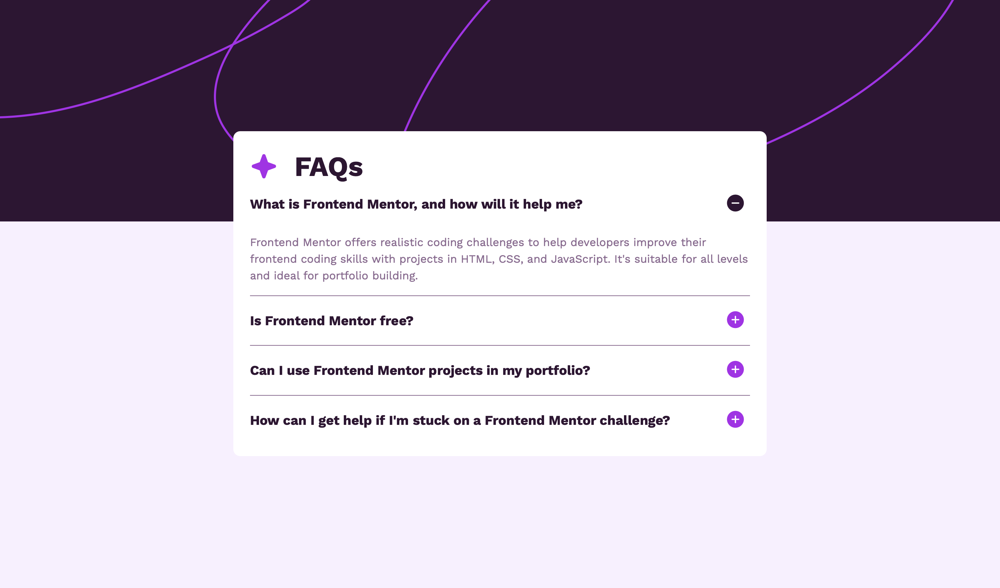

# Frontend Mentor - FAQ accordion solution

This is a solution to the [FAQ accordion challenge on Frontend Mentor](https://www.frontendmentor.io/challenges/faq-accordion-wyfFdeBwBz). Frontend Mentor challenges help you improve your coding skills by building realistic projects. 

## Table of contents

- [Overview](#overview)
  - [The challenge](#the-challenge)
  - [Screenshot](#screenshot)
  - [Links](#links)
- [My process](#my-process)
  - [Built with](#built-with)
  - [What I learned](#what-i-learned)
  - [Continued development](#continued-development)
  - [Useful resources](#useful-resources)
- [Author](#author)

## Overview

### The challenge

Users should be able to:

- Hide/Show the answer to a question when the question is clicked
- Navigate the questions and hide/show answers using keyboard navigation alone
- View the optimal layout for the interface depending on their device's screen size
- See hover and focus states for all interactive elements on the page

### Screenshot



### Links

- Solution URL: [Add solution URL here](https://your-solution-url.com)
- Live Site URL: [Add live site URL here](https://your-live-site-url.com)

## My process

### Built with

- HTML5
- CSS custom properties
- Flexbox
- Vanilla Javascript

### What I learned

This was my first time using Javascript in a project. While I suspect that my code can be improved in several ways, I am happy that I was able to make the accordion work with Javascript.

```js
let accordions = document.querySelectorAll('.accordion');
accordions.forEach(accordion => {
    accordion.addEventListener('click', e => {
        accordion.classList.toggle('active');
    })
})
```
I also learned that I can use "min-height" in CSS to define a height on a parent container and center children using Flexbox. Since I was previously using "height: 100vh;" for this purpose, this is a game changer for me. It allows the parent to grow taller than 100vh as the content grows, while still keeping the inner containers centered. 

```css
body {
  min-height: 100vh;
}
```

### Continued development

I definitely plan to continue refining my Javascript skills. While the accordion technically works, the plus and minus buttons break easily and I suspect that there is a more concise way to write the functionality that I needed for the buttons. I have yet to make my code work with keyboard shortcuts so I plan to learn how to do that as well. 

I am also continuing on my responsive design journey with CSS. 

### Useful resources

- [Learn Javascript](https://v2.scrimba.com/learn-javascript-c0v) - I completed part of this course on Scrimba before tackling the Javascript aspects of the project. The course was extremely interactive and helped me grasp the fundamentals of Javascript so that I could put something together on my own. I recommend it to anyone who wants to learn Javascript in bite-sized, interactive steps.

## Author

- Frontend Mentor - [@CamrynTidsworth](https://www.frontendmentor.io/profile/CamrynTidsworth)
- LinkedIn - [Camryn Tidsworth](www.linkedin.com/in/camryn-tidsworth)
